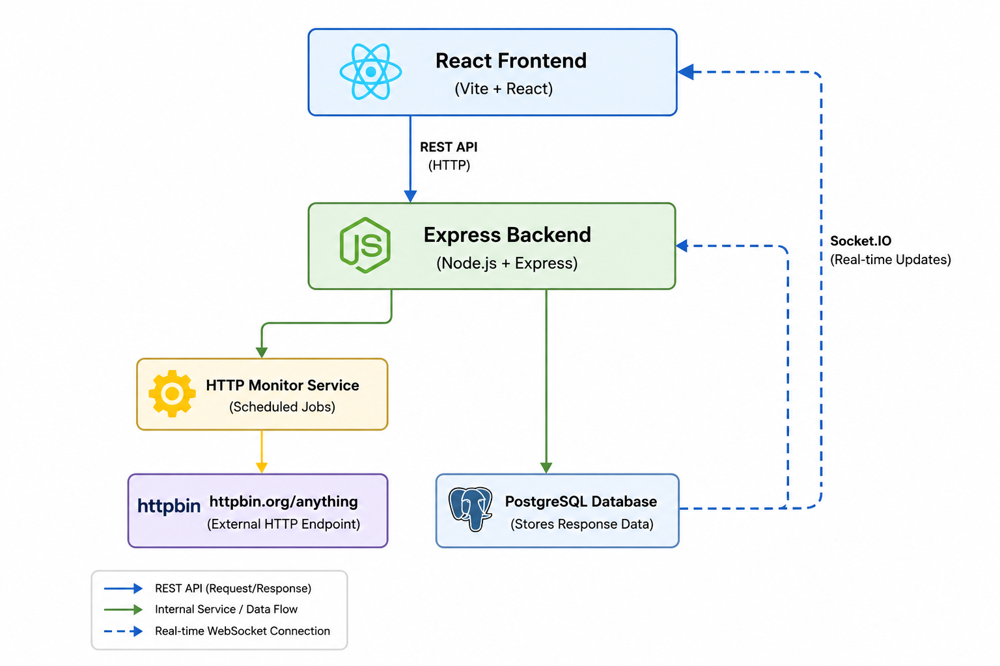

# Architecture Overview

# System Goal

The system periodically sends randomized JSON payloads to `httpbin.org/anything`, stores the responses in PostgreSQL, and displays updates in real time through a React dashboard.

---

# High-Level Architecture

---

# Data Flow

1. Scheduler triggers every 5 minutes.
2. Backend generates a random JSON payload.
3. Backend sends request to `httpbin.org/anything`.
4. Backend measures response latency.
5. Response is stored in PostgreSQL.
6. Backend broadcasts new record through Socket.IO.
7. Frontend receives and displays the update in real time.
8. Frontend can also fetch historical records through REST APIs.

---

# Backend Components

## Scheduler

Runs periodic monitoring tasks using `node-cron`.

## HTTP Monitor Service

Responsible for:
- generating random payloads
- sending requests to HTTPBin
- measuring latency
- storing monitoring results

## Database Layer

Handles persistence and retrieval of monitoring records.

## Socket Layer

Broadcasts newly created responses to connected clients.

---

# Frontend Components

## Dashboard

Displays response history in a tabular format.

## Real-Time Client

Listens for Socket.IO events and updates the UI instantly.

## API Layer

Fetches historical monitoring data from backend APIs.

---

# Database Schema

Table: `http_responses`

| Column | Description |
|---|---|
| id | Primary key |
| request_payload | Generated request payload |
| response_payload | HTTPBin response |
| status_code | HTTP response code |
| response_time_ms | Measured latency |
| endpoint | Target endpoint |
| created_at | Timestamp |
| is_anomaly | Reserved for future enhancement |
| anomaly_reason | Reserved for future enhancement |

---

# Scalability Considerations

- Socket.IO can later be scaled using Redis adapters.
- PostgreSQL can be replaced with TimescaleDB for time-series workloads.
- Scheduler can be moved to dedicated workers.
- Monitoring services can be horizontally scaled.

---

# Reliability Considerations

- API failures are persisted for visibility.
- Error handling prevents scheduler crashes.
- Database initialization happens automatically on startup.